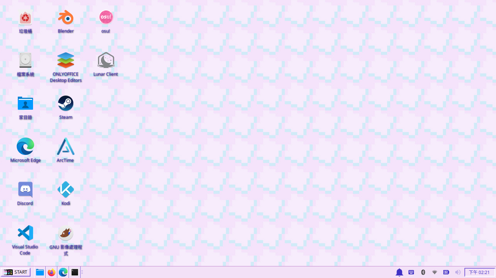
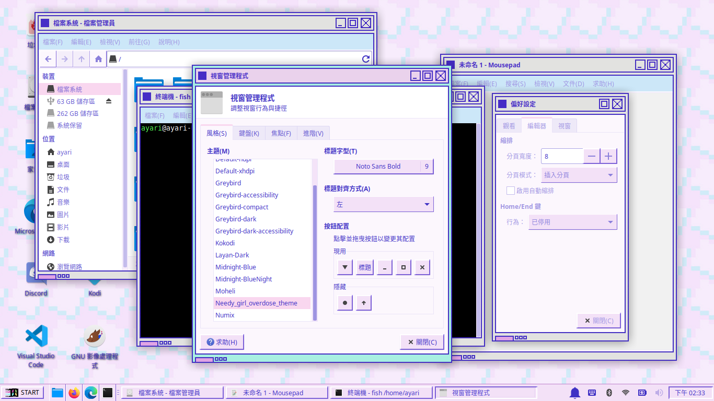

# Needy_girl_overdose_theme


## How to use?
1. Clone this project
   ```sh
   cd ~/
   git clone https://github.com/Natsuhane-Ayari/Needy_girl_overdose_theme.git
   ```
2. Create a folder named `.themes` at home directory
   ```sh
   mkdir .themes
   ```
3. Move this folder to the .themes just created
   ```sh
   mv Needy_girl_overdose_theme/ .themes/
   ```
4. Go to <ins>**Settings --> Window Manager**</ins>
   Select theme to <ins>**Needy_girl_overdose_theme**</ins>
   And set <ins>**Title Alignment**</ins> to <ins>Left</ins>
5. Back to All Settings, Then go to <ins>**Apperance**</ins>
   Set <ins>**Style**</ins> to <ins>**NEEDY-GIRL-OVERDOSE**</ins>
---
## Recommend settings
1. Set the StartMenu style
   * Right click the start menu --> Property
   * Let it display icon and title
2. Set Wallpaper
	### ※These icon and wallpaper files are in the images folder※
